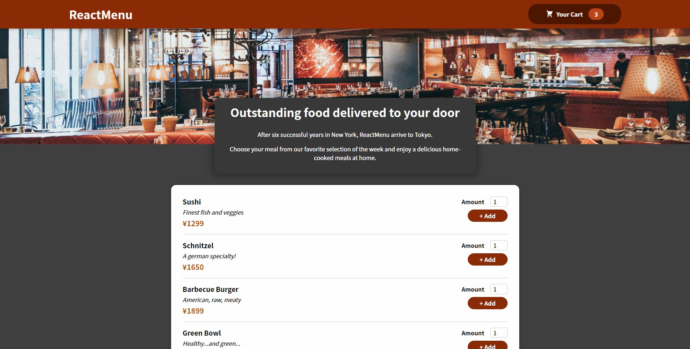
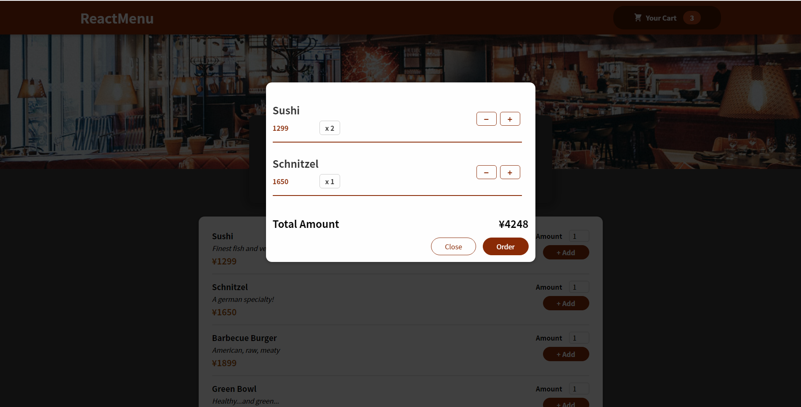

#### ReactMenu is a fake food delivery service restaurant website! You are hungry and wanna eat delicious food but don't wanna go outside. Here is the solution !

---

## Table of contents

- [General info](#general-info)
- [Screenshots](#screenshots)
- [Key learning](#key-learning)
- [Contact](#contact)

## General info

Project created during a weekend with the only purpose of practicing React knowledge.
Link : https://ofrederic-reactmenu.netlify.app/

## Screenshots

  
  &nbsp; &nbsp;
  

## Key Learning

- React hooks (useState, useContext, useRef, useReduce, useEffect, useImperativeHandle)
- Fragment
- forwardRef
- React Portal

- CSS Module

## Contact

